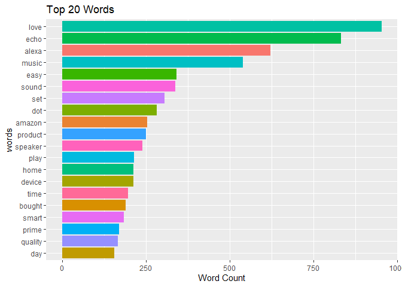
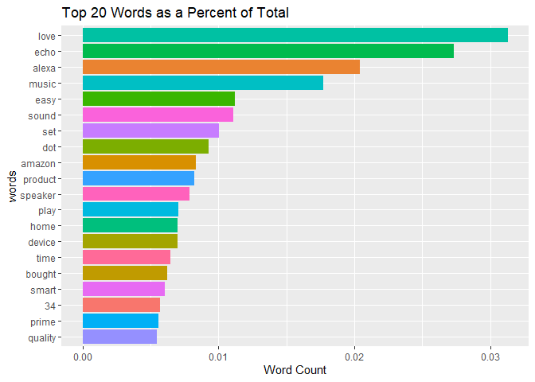
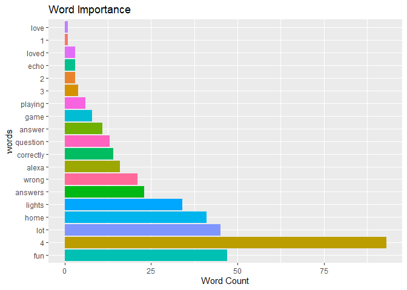
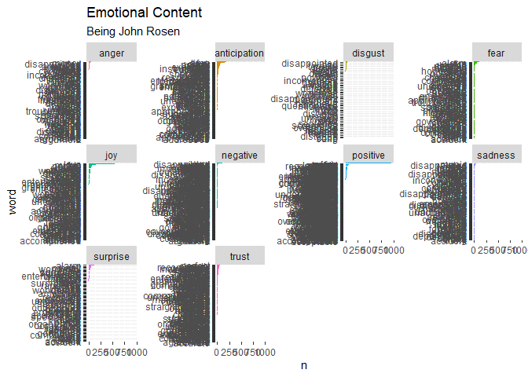
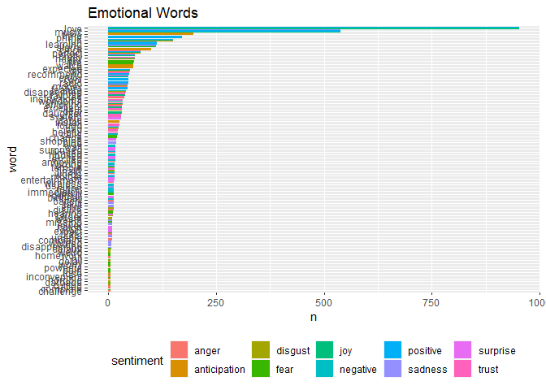
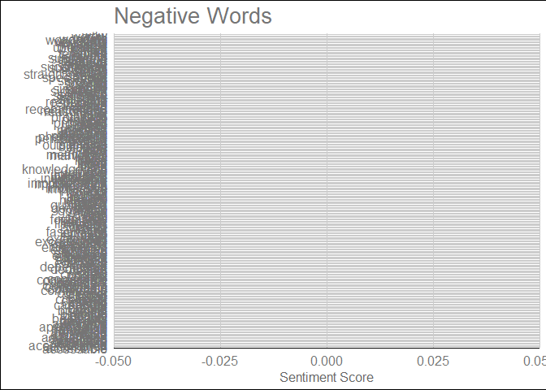
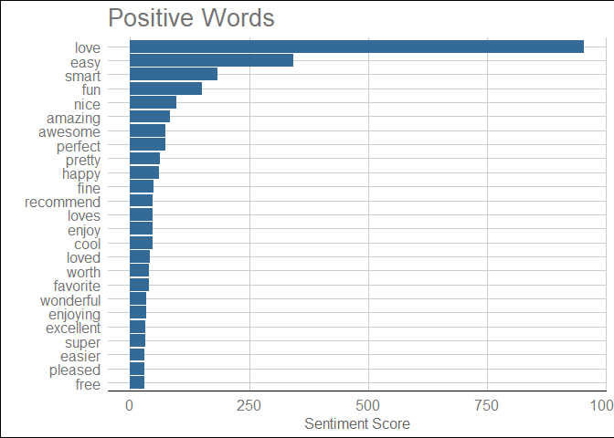
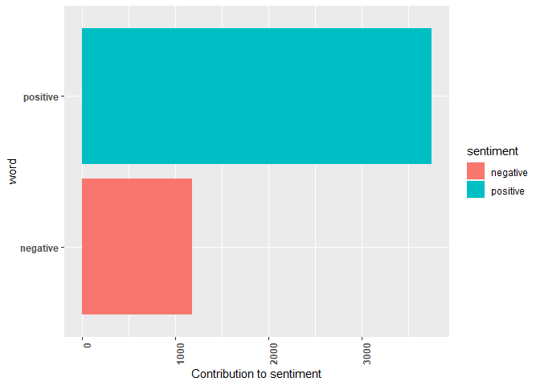

Sentiment_Analysis
================
Yeshil Bangera
2022-10-22

Loading packages

``` r
pacman::p_load(tidytext, tidyverse)
pacman::p_load(quanteda)
pacman::p_load(ggthemes)
pacman::p_load(scales)
```

``` r
text0<-readtext::readtext("D:/END TO END/SentimentAnalysis_AlexaReviews/AlexaReview.txt")
```

``` r
text = text0 %>% 
  str_remove_all("\n") %>% 
  str_trim(side = c("both")) %>% 
  str_squish() %>%
  strsplit(split = " ") %>%
  purrr::reduce(paste)

head(text,50)
```

    ##  [1] "\"x\"\"1\",\"Love"      "my"                     "Echo!\"\"2\",\"Loved"  
    ##  [4] "it!\"\"3\",\"Sometimes" "while"                  "playing"               
    ##  [7] "a"                      "game,"                  "you"                   
    ## [10] "can"                    "answer"                 "a"                     
    ## [13] "question"               "correctly"              "but"                   
    ## [16] "Alexa"                  "says"                   "you"                   
    ## [19] "got"                    "it"                     "wrong"                 
    ## [22] "and"                    "answers"                "the"                   
    ## [25] "same"                   "as"                     "you."                  
    ## [28] "I"                      "like"                   "being"                 
    ## [31] "able"                   "to"                     "turn"                  
    ## [34] "lights"                 "on"                     "and"                   
    ## [37] "off"                    "while"                  "away"                  
    ## [40] "from"                   "home.\"\"4\",\"I"       "have"                  
    ## [43] "had"                    "a"                      "lot"                   
    ## [46] "of"                     "fun"                    "with"                  
    ## [49] "this"                   "thing."

``` r
text_df <- tibble(line = 1:length(text), text = text)
View(text_df)
#Remove stopwords  ====================

data(stop_words)
stop_words
```

    ## # A tibble: 1,149 x 2
    ##    word        lexicon
    ##    <chr>       <chr>  
    ##  1 a           SMART  
    ##  2 a's         SMART  
    ##  3 able        SMART  
    ##  4 about       SMART  
    ##  5 above       SMART  
    ##  6 according   SMART  
    ##  7 accordingly SMART  
    ##  8 across      SMART  
    ##  9 actually    SMART  
    ## 10 after       SMART  
    ## # ... with 1,139 more rows

``` r
Alexadata = text_df %>% 
  unnest_tokens(word, text) %>% 
  #filter(!str_detect(word, "^[0-9]*$")) %>% 
  anti_join(stop_words)  %>% 
  distinct()
```

    ## Joining, by = "word"

``` r
head(Alexadata) 
```

    ## # A tibble: 6 x 2
    ##    line word 
    ##   <int> <chr>
    ## 1     1 1    
    ## 2     1 love 
    ## 3     3 echo 
    ## 4     3 2    
    ## 5     3 loved
    ## 6     4 3

``` r
# Count Tokens =============================
Alexadata %>%
  count(word, sort = TRUE)
```

    ## # A tibble: 6,841 x 2
    ##    word        n
    ##    <chr>   <int>
    ##  1 love      953
    ##  2 echo      832
    ##  3 alexa     622
    ##  4 music     539
    ##  5 easy      342
    ##  6 sound     338
    ##  7 set       306
    ##  8 dot       283
    ##  9 amazon    254
    ## 10 product   251
    ## # ... with 6,831 more rows

``` r
Alexadata %>%
  filter(!str_detect(word, "^[0-9]*$")) %>%
  count(word, sort = TRUE) %>%
  slice(1:20) %>% 
  ggplot(aes(reorder(word, n), n, fill = word)) +
  geom_col()+ coord_flip() + 
  xlab("words") + 
  ylab("Word Count")+
  theme(legend.position = "")+
  ggtitle("Top 20 Words")
```

<!-- -->

``` r
Alexadata %>% 
  count(word, sort = TRUE) %>%
  mutate(proportion = n / sum(n)) %>% 
  slice(1:20) %>%
  ggplot(aes(reorder(word, proportion), proportion, fill = word)) +
  geom_col()+ coord_flip() + 
  xlab("words") + 
  ylab("Word Count")+
  theme(legend.position = "")+
  ggtitle("Top 20 Words as a Percent of Total")
```

<!-- -->

``` r
Alexadata %>%
  
  group_by(line) %>% 
  top_n(10) %>% 
  ungroup() %>% 
  slice(1:20) %>% 
  ggplot(aes(reorder(word, -line), line, fill = word)) +
  geom_col()+ coord_flip() + 
  xlab("words") + 
  ylab("Word Count")+
  theme(legend.position = "")+
  ggtitle("Word Importance")
```

    ## Selecting by word

<!-- -->

``` r
#======================================================= #
# Contribution to Sentiment/Emotion ====================
# Word Contribution to Sentiment (i.e Pos or Neg):   
# (aka top 10 words by sentiment)

bing_dict = get_sentiments("bing")
head(bing_dict)
```

    ## # A tibble: 6 x 2
    ##   word       sentiment
    ##   <chr>      <chr>    
    ## 1 2-faces    negative 
    ## 2 abnormal   negative 
    ## 3 abolish    negative 
    ## 4 abominable negative 
    ## 5 abominably negative 
    ## 6 abominate  negative

``` r
afinn_dict = get_sentiments("afinn")
head(afinn_dict)
```

    ## # A tibble: 6 x 2
    ##   word       value
    ##   <chr>      <dbl>
    ## 1 abandon       -2
    ## 2 abandoned     -2
    ## 3 abandons      -2
    ## 4 abducted      -2
    ## 5 abduction     -2
    ## 6 abductions    -2

``` r
# Word Contribution to Emotion (i.e 
# anger, anticipation, disgust, fear, joy, negative, positive,
# sadness, surprise, trust):   


nrc_dict = get_sentiments("nrc")
head(nrc_dict)
```

    ## # A tibble: 6 x 2
    ##   word      sentiment
    ##   <chr>     <chr>    
    ## 1 abacus    trust    
    ## 2 abandon   fear     
    ## 3 abandon   negative 
    ## 4 abandon   sadness  
    ## 5 abandoned anger    
    ## 6 abandoned fear

``` r
table(nrc_dict$sentiment)
```

    ## 
    ##        anger anticipation      disgust         fear          joy     negative 
    ##         1246          837         1056         1474          687         3318 
    ##     positive      sadness     surprise        trust 
    ##         2308         1187          532         1230

``` r
se = nrc_dict %>% dplyr::select(word, sentiment)
head(se)
```

    ## # A tibble: 6 x 2
    ##   word      sentiment
    ##   <chr>     <chr>    
    ## 1 abacus    trust    
    ## 2 abandon   fear     
    ## 3 abandon   negative 
    ## 4 abandon   sadness  
    ## 5 abandoned anger    
    ## 6 abandoned fear

``` r
Alexadata %>%
  inner_join(se) %>% 
  #count(word, sentiment, sort=TRUE) %>% 
  group_by(sentiment) %>% 
  count(word, sentiment, sort=TRUE) %>%
  #dplyr::top_n(15) %>% 
  ungroup() %>%
  mutate(word=reorder(word, n)) %>% 
  ggplot(aes(word, n)) + 
  geom_col(aes(fill=sentiment)) +
  facet_wrap(~sentiment, scale="free_y") + 
  coord_flip()+
  labs(title = "Emotional Content", subtitle = "Being John Rosen")+
  theme(legend.position = "none")
```

    ## Joining, by = "word"

<!-- -->

``` r
Alexadata %>%
  inner_join(se) %>% 
  count(word, sentiment, sort=TRUE) %>% 
  group_by(sentiment) %>% 
  dplyr::top_n(15) %>% 
  ungroup() %>%
  mutate(word=reorder(word, n)) %>% 
  ggplot(aes(word, n)) + 
  geom_col(aes(fill=sentiment), position = "dodge") +
  coord_flip()+
  ggtitle("Emotional Words")+
  theme(legend.position = "bottom")
```

    ## Joining, by = "word"
    ## Selecting by n

<!-- -->

``` r
(  se = bing_dict %>% dplyr::select(word, sentiment)  )
```

    ## # A tibble: 6,786 x 2
    ##    word        sentiment
    ##    <chr>       <chr>    
    ##  1 2-faces     negative 
    ##  2 abnormal    negative 
    ##  3 abolish     negative 
    ##  4 abominable  negative 
    ##  5 abominably  negative 
    ##  6 abominate   negative 
    ##  7 abomination negative 
    ##  8 abort       negative 
    ##  9 aborted     negative 
    ## 10 aborts      negative 
    ## # ... with 6,776 more rows

``` r
Alexa_sent = Alexadata %>%
  inner_join(se) %>% 
  count(word, sentiment, sort=TRUE) %>% 
  #tibble:: rowid_to_column("index") %>%
  #count(index  %/% 80, sentiment) %>%
  spread(sentiment, n, fill = 0) %>%
  dplyr::mutate(sentiment = positive - negative)
```

    ## Joining, by = "word"

``` r
head(Alexa_sent)
```

    ## # A tibble: 6 x 4
    ##   word         negative positive sentiment
    ##   <chr>           <dbl>    <dbl>     <dbl>
    ## 1 accessable          0        1         1
    ## 2 accessible          0        2         2
    ## 3 accomplish          0        2         2
    ## 4 accomplished        0        1         1
    ## 5 accurate            0        1         1
    ## 6 accurately          0        2         2

``` r
Alexa_sent %>% dplyr::count(word, negative, sort = T) %>%
  top_n(-25, negative) %>%
  ggplot(aes(reorder(word, -negative), negative, fill = word)) +
  geom_col(show.legend = FALSE, fill = "darkred") +
  coord_flip() +labs(title = "Negative Words", x = "", y = "Sentiment Score")+
  theme_gdocs()
```

<!-- -->

``` r
head((arrange(Alexa_sent, desc(sentiment))))
```

    ## # A tibble: 6 x 4
    ##   word    negative positive sentiment
    ##   <chr>      <dbl>    <dbl>     <dbl>
    ## 1 love           0      953       953
    ## 2 easy           0      342       342
    ## 3 smart          0      184       184
    ## 4 fun            0      151       151
    ## 5 nice           0       98        98
    ## 6 amazing        0       84        84

``` r
Alexa_sent %>% dplyr::count(word, positive, sort = TRUE) %>%
  top_n(25, positive) %>%
  ggplot(aes(reorder(word, positive), positive, fill = n)) +
  geom_col(show.legend = FALSE) +
  coord_flip() +labs(title = "Positive Words" , x = "", y = "Sentiment Score")+
  theme_gdocs()
```

<!-- -->

``` r
#============================================================================= # 
#Sentiment Index =============================================================
(  Alexa_sent2 = Alexadata %>%
     inner_join(se) %>% 
     count(word, sentiment, sort=TRUE)   )
```

    ## Joining, by = "word"

    ## # A tibble: 584 x 3
    ##    word    sentiment     n
    ##    <chr>   <chr>     <int>
    ##  1 love    positive    953
    ##  2 easy    positive    342
    ##  3 smart   positive    184
    ##  4 fun     positive    151
    ##  5 alarm   negative    110
    ##  6 nice    positive     98
    ##  7 amazing positive     84
    ##  8 awesome positive     75
    ##  9 perfect positive     74
    ## 10 pretty  positive     62
    ## # ... with 574 more rows

``` r
head(Alexa_sent2)
```

    ## # A tibble: 6 x 3
    ##   word  sentiment     n
    ##   <chr> <chr>     <int>
    ## 1 love  positive    953
    ## 2 easy  positive    342
    ## 3 smart positive    184
    ## 4 fun   positive    151
    ## 5 alarm negative    110
    ## 6 nice  positive     98

``` r
Alexa_sent2 %>%
  #filter(n > 3) %>%
  #mutate(nn = ifelse(sentiment == "negative", -n, n)) %>%
  mutate(word = reorder(sentiment, n)) %>%
  ggplot(aes(word, n, fill = sentiment)) +
  geom_bar(stat = "identity") +
  theme(axis.text.x = element_text(angle = 90, hjust = 1),
        axis.text = element_text(face="bold")) +
  ylab("Contribution to sentiment")  +
  coord_flip() 
```

<!-- -->

``` r
# Sentiment Ratio ===========================
Alexa_negative <- Alexa_sent2 %>%
  filter(sentiment == "negative") %>% dplyr::select(n) %>% colSums()

Alexa_positive <- Alexa_sent2 %>%
  filter(sentiment == "positive") %>% dplyr::select(n) %>% colSums()


Alexa_ratio = (Alexa_positive- Alexa_negative)*100/(Alexa_positive+ Alexa_negative)

Alexa_ratio
```

    ##        n 
    ## 52.15893
